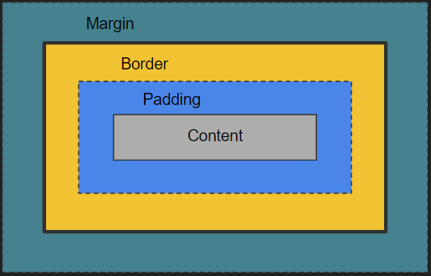
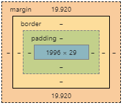

# 9. The Box model

Every element in a HTML document is modelled by CSS as a box with 4 separate components, from the inside out.

1. Content - The content of the element itself, typically child elements, text or images
2. Padding - A padding can be set to surround the content.
3. Border - A border can be set to mark the outline of an element.
4. Margin - A margin that surrounds the element.



This view of an element is also visible in for instance the Chrome inspector along with the size of each part.



You might have noticed something a bit odd with the above list. I wrote that a margin "surrounds" an element, which implies that it is not part of the element at all.
This is correct, a margin is not considered to be part of the extent of an element.

```html
<p style="margin-top: 10px;">Some text</p>
```

In the case of the p tag above, the height of the element would not include the margin.

In fact, a surrounding parent element, does not wrap the margin of a child if it has no other content that the margin would overlap.

```html
<div id="outer">
    <p style="margin-top: 10px;">Some text</p>
</div>
```

The margin would neither be considered part of the content for the child nor the parent element and instead extend outside 10px on top of both of the elements.

Adding content to the parent element that would interfere with the margin, would however make the parent element wrap the child element along with it's margin.

```html
<div id="outer">
    Text
    <p style="margin-top: 10px;">Some text</p>
</div>
```

In the case above, the #outer element would extend around the entire contents of the child element as well as it's margin and the text that was declared directly inside of the #outer div.

We will talk a bit more about margins and how they interact in a later exercise.

## The task

Please add some height to our heading-section element using the height property. For now set it using a pixel value.

```css
#heading-section {
    background: #EC9A29;
    height: 200px;
}
```

Once that is done, reload the page in the browser and use the inspector to look at the box model.

What is the sizes of your #heading-section element?
What is the sizes of your #heading-section h1 element?

Hover over the elements in the browser using the selection tool in Chrome and note what it sais about the size.


Now, add a padding of 20px to the same element and redo all the same examinations.

You can add a padding by using the shorthand property _padding_:

```css
#heading-section {
    padding: 20px;
}
```

Which would be the same as writing:

```css
#heading-section {
    padding-top: 20px;
    padding-right: 20px;
    padding-bottom: 20px;
    padding-left: 20px;
}
```

Add a border, using the _border_ shorthand property.

```css
#heading-section {
    border: 5px solid black;
}
```

Which is the same as:

```css
#heading-section {
    border-top-width: 5px;
    border-right-width: 5px;
    border-bottom-width: 5px;
    border-left-width: 5px;
    border-top-style: solid;
    border-right-style: solid;
    border-bottom-style: solid;
    border-left-style: solid;
    border-top-color: black;
    border-right-color: black;
    border-bottom-color: black;
    border-left-color: black;
}
```

and then examine the #heading-section and wrapped h1 elements once again

We will talk more about shorthand properties in a later exercise.

Finally give the #heading-section a width of 100%, notice that this leaves the web page in a bit of an odd state with the horizontal scroll bar showing at the bottom of the browser window. This has to do with the box-sizing model which we'll be revisiting as well in a later exercise to fix the problem you are seeing.

## The solution

The modified CSS for the #heading-section selector rule was all given as part of the task and looks like this.

```css
#heading-section {
    background: #EC9A29;
    height: 200px;
    padding: 20px;
    border: 5px solid black;
    width: 100%;
}
```
What you may have noticed is that the height of the element as reported in the box model depiction has a 
content height of 200px, but hovering over the element using the selection tool reports that the element is 250px high.

This is because the instruction to give it a height of 200px refers to only the content height, on top of this padding and border sizes are added (2 x 5px + 2 x 20px = 50px).

The same goes for the width instruction that we gave, the 100% refers to the full width of the surrounding main element. 
Again, padding and border sizes are added making the #heading-section element 50 pixels wider than it's parent (hence the horizontal scroll bar).

We will fix this in the upcoming exercise on box-sizing.