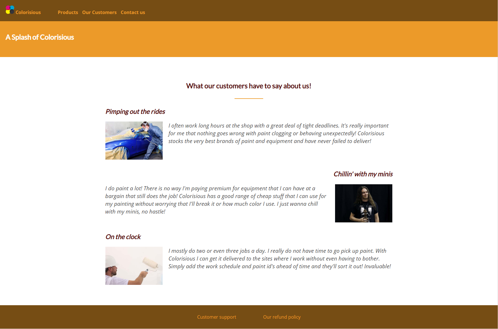

# 19. A new page

## The task

Create the testimonials page.

Start by copying all of the material inside the body tag of the main page.

Remove everything between the #heading-section and the #footer-section.

Fix the navigation bar links.

Now, we are going to move some of the material from the main.css file into a shared.css file that can be used from both of the pages.

Move all of the general styling as well as rules referring directly  to the header and footer into the new shared.css file.

Add a new link element to the main HTML file, above the one referring to main.css and use it to include shared.css

Check that your page looks the way it did before.

Copy the link elements, except the one referring to main.css and paste it into the head element of the testimonials page. Fix the file paths of the copied links.

Add a new style sheet directly under the testimonials directory and name it testimonials.css and link it into the page.

Check the look of the testimonials page by clicking the "Our Customers" link on the navigation bar.

Now copy the contents of the tesimonials-section.html file and paste it into the testimonials page, between the #heading section and the #footer-section.

Style the new page by adding some spacing for the new section making it look something along the lines of this.

