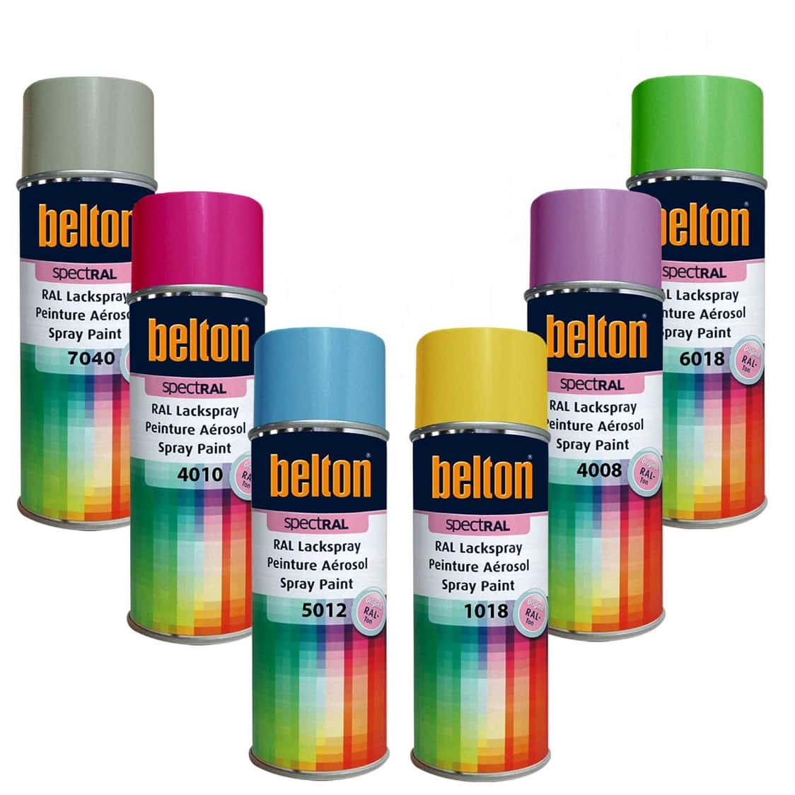

# 17. Product short list

## The solution

I made a few adjustments to the h2 level tags since we added another section which should also have them centered. Also
added some spacing and a line separated using the ::after pseudo class

```css
h2 {
    text-align: center;
}

h2::after {
    display: block;
    height: 2px;
    background-color: #EC9A29;
    content: " ";
    width: 100px;
    margin: 30px auto 0;
}
```

This means that I could remove the #retailer-section h2 selector that I was using previously.

I set up some classes in the HTML to be able to more precisely select the elements that I wanted to style.

```html
<section id="favourites-section">
    <h2>Some of our favourite products</h2>
    <ul class="product__images">
        <li class="product__image-item">
            
        </li>
        <li class="product__image-item">
            
        </li>
        <li class="product__image-item">
            
        </li>
        <li class="product__image-item">
            
        </li>
    </ul>
</section>
```

The new #favourites-section got the same top margin that the #retailer-section.

```css
#favourites-section {
    margin-top: 45px;
}
```

Since the images were layed out in a list I removed the bullet points, margin and paddings of the list by:

```css
.product__images {
    list-style: none;
    margin: 30px 0 0 0;
    padding: 0;
}
```

This gives the list a top margin of 30px and clears the other sides as well as all padding.

The images were resized using the following. I also set opacity to 70& and the containing list item background to black as to darken them a little bit.
The float property was useful in this case, since that removes the posibility of white space interfereing with the layout.

```css
.product__image-item {
    float: left;
    width: 25%;
    background: black;
}

.product__image-item img {
    opacity: 0.7;
    vertical-align: middle;
    width: 100%;
}
```

Also note the vertical-align property used, this was added to avoid the images being placed on the box baseline for text leaving 
a small area under the image uncovered.

Since we floated the list items, I now need to add a clearfix so that the list actually does take up some space in the document flow.
The cleanfix I added looks like this. 

```css
.clearfix {
    overflow: auto;
}

.clearfix::after {
    content: "";
    clear: both;
    display: table;
}
```

```html
<ul class="product__images clearfix">
    <li class="product__image-item">
        
    </li>
    <li class="product__image-item">
        
    </li>
    <li class="product__image-item">
        
    </li>
    <li class="product__image-item">
        
    </li>
</ul>
```

Read about it here: https://www.w3schools.com/howto/howto_css_clearfix.asp